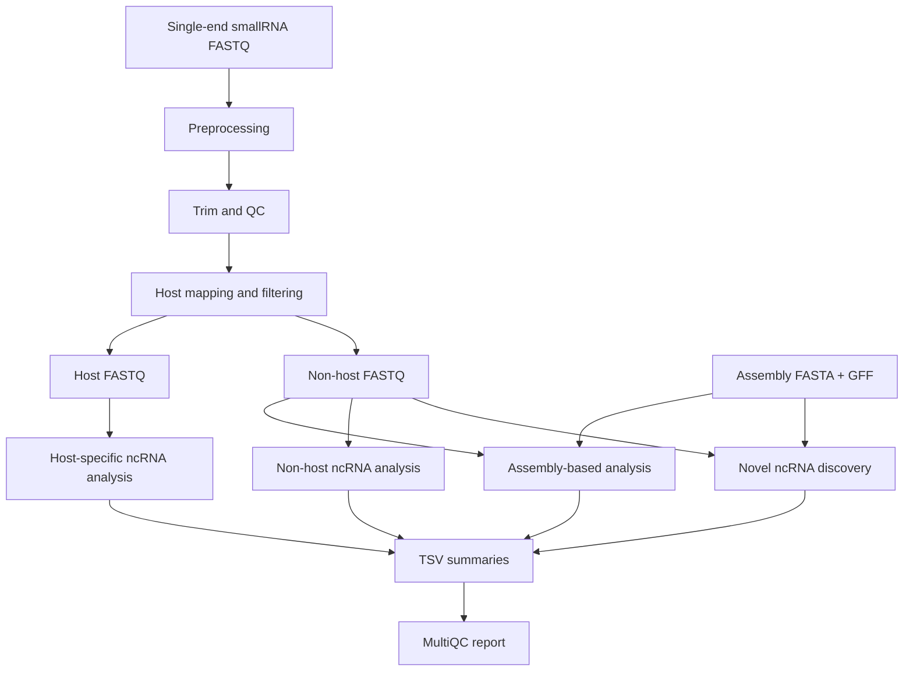

# Workflow

```mermaid
flowchart TD
    A[Single-end smallRNA FASTQ] --> B[Preprocessing]
    B --> C[Trim and QC]
    C --> D[Host mapping and filtering]
    D --> E[Host FASTQ]
    D --> F[Non-host FASTQ]
    F --> G[Assembly-based analysis]
    E --> H[Host-specific ncRNA analysis]
    F --> I[Non-host ncRNA analysis]
    F --> J[Novel ncRNA discovery]
    K[Assembly FASTA + GFF] --> G
    K --> J
    G --> L[TSV summaries]
    H --> L
    I --> L
    J --> L
    L --> M[MultiQC report]
```
