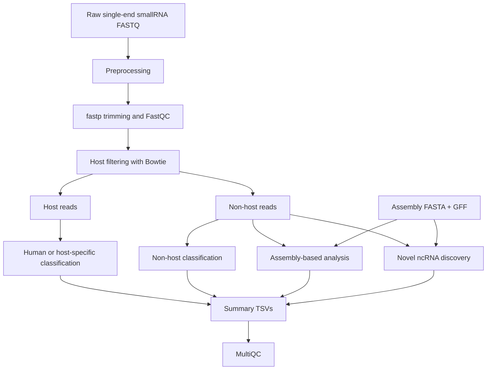

# Workflow

```mermaid
flowchart TD
    A[Raw single-end smallRNA FASTQ] --> B[Preprocessing]
    B --> C[fastp trimming and FastQC]
    C --> D[Host filtering with Bowtie]
    D --> E[Host reads]
    D --> F[Non-host reads]
    E --> G[Human or host-specific classification]
    F --> H[Non-host classification]
    F --> I[Assembly-based analysis]
    F --> J[Novel ncRNA discovery]
    K[Assembly FASTA + GFF] --> I
    K --> J
    G --> L[Summary TSVs]
    H --> L
    I --> L
    J --> L
    L --> M[MultiQC]
```

## Resume Logic

Each workflow writes a completion marker under the sample directory. Re-runs skip completed stages when the marker and expected outputs are both present.
